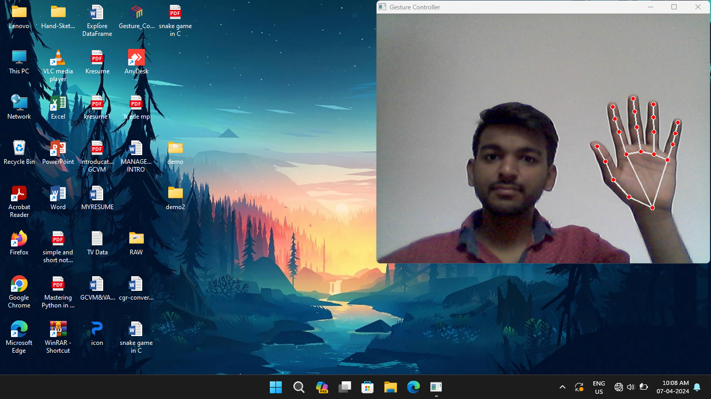

# 🖱️ Gesture Controlled Virtual Mouse

A Python-based virtual mouse that uses **hand gestures** and **voice commands** to control mouse actions. Built using OpenCV, MediaPipe, and PyAutoGUI, this project provides an accessible, touchless way to interact with a computer.

---

## 📽️ Demo

  
<!-- You can replace this with a demo GIF or link to a video -->

---

## 🚀 Features

- 👆 Move cursor using hand
- ✌️ Click and right-click with finger combinations
- 👉 Scroll using finger gestures
- 🎤 Voice assistant for basic commands
- 🧠 Real-time gesture detection using MediaPipe

---

## 🛠️ Technologies Used

- Python 3
- OpenCV
- MediaPipe
- PyAutoGUI
- SpeechRecognition
- pyttsx3 (Text-to-Speech)
- pyaudio (Microphone input)

---

## 🖥️ Installation

### 1️⃣ Clone the Repository

```bash
git clone https://github.com/yourusername/gesture-controlled-virtual-mouse.git
cd gesture-controlled-virtual-mouse
